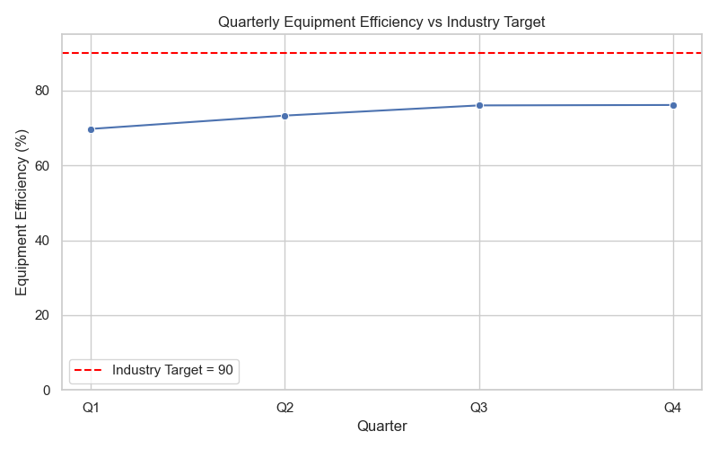
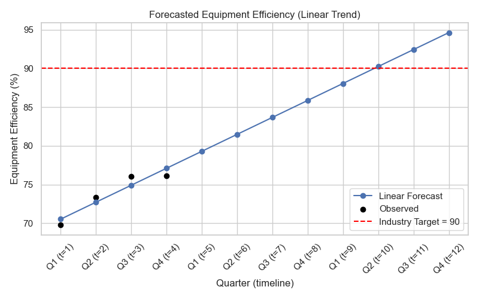

**Equipment Efficiency — 2024 Quarterly Analysis**

- **Dataset:** Quarterly equipment efficiency rates for 2024: `Q1: 69.77`, `Q2: 73.33`, `Q3: 76.05`, `Q4: 76.16`.
- **Average:** 73.83
- **Industry Target:** 90
- **Contact (verification):** 24f3001383@ds.study.iitm.ac.in
**Key Findings**

- **Recent trend:** Efficiency rose steadily across 2024 from **69.77 (Q1)** to **76.16 (Q4)**, an encouraging upward trend.
- **Average (2024):** The computed average efficiency for the year is **73.83**.
- **Gap to industry target:** The industry benchmark is **90**, so the 2024 average is **16.17 percentage points** below the target.

**Visual summary**

The two figures below illustrate the observed quarterly trend compared to the industry target and a short linear forecast based on the 4 quarterly observations.





**Forecast interpretation**

- A simple linear regression on the four observed quarters produces the forecast in `outputs/forecast_table.csv`.
- According to the linear forecast, the model crosses the 90% threshold at **quarter index ~10**, which corresponds to **Q2 2026** (index mapping: index 1 = Q1 2024). That means, without any interventions, the current linear trend would take roughly 2.25 years from the start of 2024 to reach the 90% target.

**Business Implications**

- While the trend is positive, at the current rate of improvement the target of 90% is reached only in multiple years — too slow for organizations that need competitive parity or must meet contractual/operational KPIs in the short term.
- The persistent gap implies continued lost throughput, higher cost per unit, and elevated risk of missed SLAs.
- The likely root cause is a maintenance strategy that still relies on reactive or strictly calendar-based interventions rather than condition-driven, predictive work.

**Recommendation (Solution): implement predictive maintenance program**

To accelerate improvement and close the 16.17-point gap, implement a focused predictive maintenance program. Key steps:

- **Data foundation:** instrument critical equipment to collect time-series telemetry (vibration, temperature, RPM, power draw), operational context (loads, shifts), and failure/repair logs.
- **Pilot (6 months):** select 2–3 high-impact machines for a pilot combining sensors + data ingestion + basic analytics. Track MTBF, MTTR, uptime and efficiency.
- **Modeling & ops:** build anomaly detection and failure-prediction models, then integrate predictions into a maintenance workflow that schedules interventions only when risk is elevated.
- **Change management:** train maintenance teams on new workflows and prioritize work by predicted risk and business impact.
- **Measure & iterate:** set short-term targets (e.g., +2–4 percentage points equipment efficiency per 6 months) and monitor ROI (downtime avoided, maintenance cost savings).

**Expected impact**

- Predictive maintenance reduces unplanned downtime and increases mean uptime; even modest efficiency gains (3–7 percentage points over 12 months) compound to close most of the gap to 90 faster than the current linear trend.

**Files added**

- `efficiency_analysis.py` — analysis script (in this workspace) that computes the average, creates plots, and writes `outputs/forecast_table.csv`.
- `requirements.txt` — Python packages needed to run the analysis.

**Run locally (Windows `cmd.exe`)**

```
python -m venv .venv
.\\.venv\\Scripts\\activate
pip install -r requirements.txt
python efficiency_analysis.py
```

This will create an `outputs` folder with `trend_vs_target.png`, `forecast.png`, and `forecast_table.csv` for review.

**Contact / verification**

24f3001383@ds.study.iitm.ac.in - Rtamanyu N J

If you want, I can open a PR with these files, attach the generated images directly to the PR description, or extend the analysis with a short pilot plan and a richer forecasting model (e.g., Prophet or SARIMA). 
